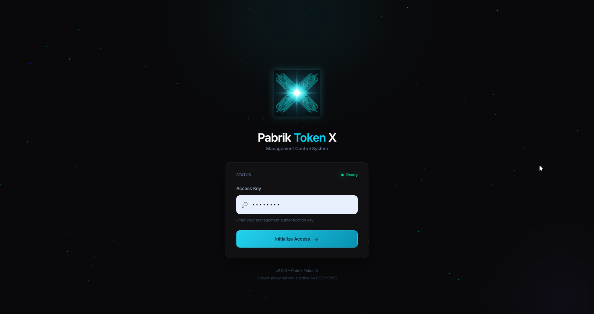
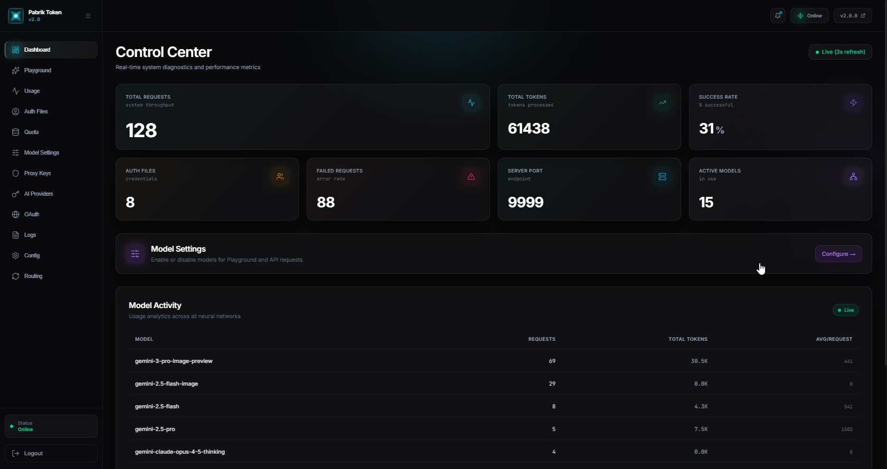
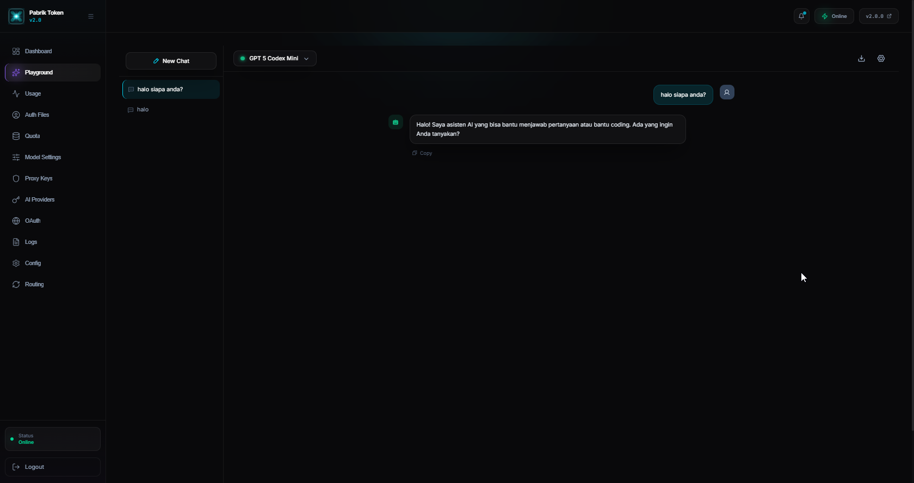
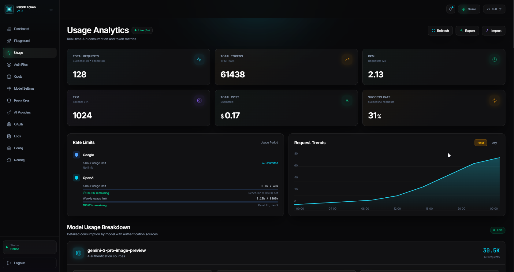
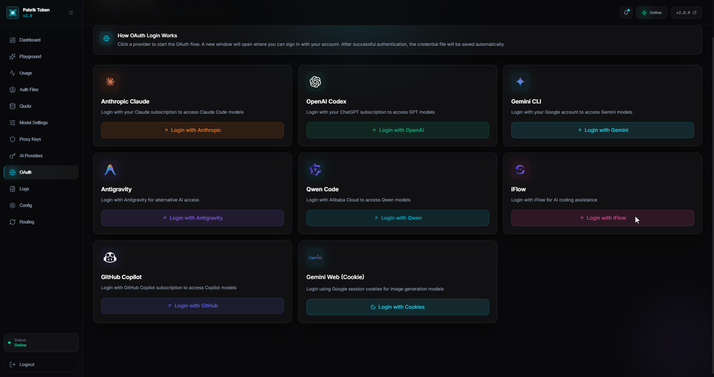
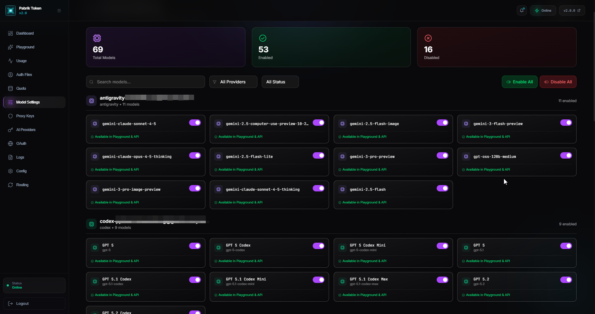
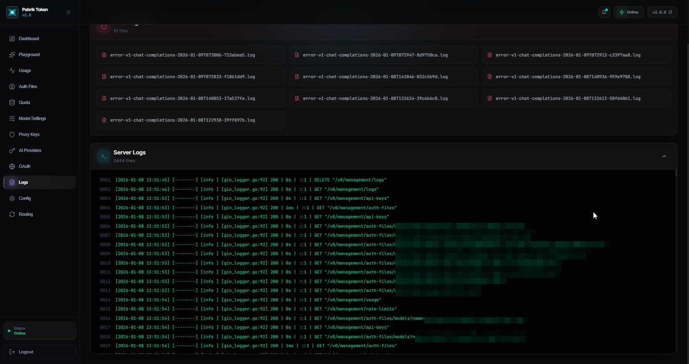

# PabrikTokenX

> **Enterprise-grade OAuth proxy server for AI coding platforms** - Access Claude, Gemini, OpenAI Codex, and more through a unified API without managing API keys.

[](LICENSE)
[](https://go.dev)
[](CONTRIBUTING.md)

---

## 🚀 Overview

PabrikTokenX is a production-ready proxy server that provides OpenAI/Gemini/Claude compatible API endpoints for CLI-based AI models. It enables seamless integration with AI coding tools by handling OAuth authentication and providing multi-account load balancing.

### ✨ Key Features

- **🔐 OAuth Authentication** - Support for Claude Code, OpenAI Codex, Gemini CLI, Qwen Code, iFlow, Antigravity, and GitHub Copilot
- **🌐 OpenAI-Compatible API** - Drop-in replacement for OpenAI API clients
- **⚖️ Load Balancing** - Round-robin distribution across multiple accounts
- **🎯 Provider Routing** - Smart routing with automatic failover
- **🔄 Multi-Modal Support** - Text, images, and function calling
- **📊 Usage Tracking** - Built-in statistics and monitoring
- **🎨 Modern Dashboard** - Sleek React-based UI with glassmorphism design and smooth animations
- **🖼️ Custom Branding** - Professional logo integration across all pages
- **🔌 Extensible SDK** - Reusable Go SDK for custom integrations
- **🐳 Docker Compose Ready** - One-command deployment with Docker Compose
- **🎮 Interactive Playground** - Test models directly from the dashboard with streaming responses
- **🔑 Proxy Key Management** - Secure API key generation and management
- **📱 Responsive Design** - Works seamlessly on desktop, tablet, and mobile devices
- **🎭 Provider Icons** - Official provider logos for better visual recognition
- **🍪 Cookie Authentication** - Support for Gemini Web cookie-based authentication

---

## 📋 Table of Contents

- [Screenshots](#-screenshots)
- [Requirements](#-requirements)
- [Quick Start](#-quick-start)
- [Docker Deployment](#-docker-deployment)
- [Installation](#-installation)
- [Configuration](#-configuration)
- [Usage](#-usage)
- [API Documentation](#-api-documentation)
- [Management Scripts](#-management-scripts)
- [Development](#-development)
- [Contributing](#-contributing)
- [License](#-license)

---� Screenshots

### Login Page

*Secure authentication with professional branding and animated effects*

### Dashboard Overview

*Real-time statistics, usage metrics, and beautiful glassmorphism design*

### Interactive Playground

*Test AI models in real-time with streaming responses and conversation history*

### Usage Analytics

*Comprehensive usage tracking with per-model statistics and visual charts*

### OAuth Management

*One-click authentication with multiple AI providers using official provider logos*

### Model Settings

*Configure model parameters and routing strategies*

### Logs Monitoring

*Real-time logs and error tracking for debugging*

---

## �

## 💻 Requirements

### System Requirements

- **Operating System**: Windows 10/11, macOS 10.15+, or Linux
- **Memory**: Minimum 512MB RAM (1GB+ recommended)
- **Disk Space**: 100MB free space

### Software Dependencies

| Software | Version | Purpose |
|----------|---------|---------|
| Go | 1.21+ | Backend runtime |
| Node.js | 18+ | Frontend development |
| npm | 9+ | Package management |

---

## 🎯 Quick Start

### Prerequisites

Before starting, ensure you have:
- Configured OAuth credentials (see [Security Configuration](#-security-configuration))
- Go 1.21+ installed
- Node.js 18+ (for frontend)

### Windows Users

1. **Clone the repository:**
   ```bash
   git clone https://github.com/tamaproject360/pabriktokenx.git
   cd pabriktokenx
   ```

2. **Configure OAuth credentials (REQUIRED):**
   ```bash
   # Copy the example environment file
   copy .env.example .env
   
   # Edit .env and add your OAuth credentials
   notepad .env
   ```

3. **Start all services:**
   ```bash
   start-all.bat
   ```

4. **Access the dashboard:**
   - **Backend API**: http://localhost:9999
   - **Frontend Dashboard**: http://localhost:3000

---

## 🔒 Security Configuration

### Default vs Custom OAuth Credentials

PabrikTokenX comes with **default OAuth credentials** for quick setup, but you can use your own for better security and control.

| Feature | Default Credentials | Custom Credentials |
|---------|-------------------|-------------------|
| **Setup Time** | ✅ Instant - No configuration needed | ⏱️ 10-15 minutes setup |
| **Rate Limits** | ⚠️ Shared with all users | ✅ Dedicated for you |
| **Privacy** | ⚠️ Google tracks "CLIProxyAPI" usage | ✅ Your own app name |
| **Revocation Risk** | ⚠️ If abused, affects all users | ✅ Only affects you |
| **Recommended For** | Testing, Development | Production, Personal Use |

### Option 1: Use Default Credentials (Quick Start)

**No configuration needed!** Just start the application and authenticate:

```bash
# Start the application
start-all.bat

# Go to OAuth page in dashboard
# Click "Authenticate" for Gemini CLI or Antigravity
# Login with your Google account
```

The application uses embedded OAuth credentials that work out-of-the-box.

### Option 2: Use Custom Credentials (Recommended for Production)

For better security, privacy, and dedicated rate limits, create your own OAuth credentials:

#### Step 1: Create Google Cloud Project

1. Go to [Google Cloud Console](https://console.cloud.google.com/)
2. Click **"Select a project"** → **"New Project"**
3. Enter project name (e.g., "My PabrikTokenX")
4. Click **"Create"**

#### Step 2: Enable Required APIs

1. In your project, go to **"APIs & Services"** → **"Library"**
2. Search and enable these APIs:
   - **Cloud Resource Manager API**
   - **Cloud Code API** (for Antigravity)
   - **Generative Language API** (for Gemini)

#### Step 3: Configure OAuth Consent Screen

1. Go to **"APIs & Services"** → **"OAuth consent screen"**
2. Choose **"External"** user type
3. Fill in required fields:
   - **App name**: Your app name (e.g., "My PabrikTokenX")
   - **User support email**: Your email
   - **Developer contact**: Your email
4. Click **"Save and Continue"**

#### Step 4: Add Required Scopes

Click **"Add or Remove Scopes"** and add these scopes:

**For Gemini CLI:**
```
https://www.googleapis.com/auth/cloud-platform
https://www.googleapis.com/auth/userinfo.email
https://www.googleapis.com/auth/userinfo.profile
```

**For Antigravity (additional scopes):**
```
https://www.googleapis.com/auth/cclog
https://www.googleapis.com/auth/experimentsandconfigs
```

Click **"Update"** → **"Save and Continue"**

#### Step 5: Add Test Users (Optional)

If your app is in testing mode:
1. Click **"Add Users"**
2. Add your Google account email
3. Click **"Save and Continue"**

#### Step 6: Create OAuth Credentials

1. Go to **"APIs & Services"** → **"Credentials"**
2. Click **"+ Create Credentials"** → **"OAuth client ID"**
3. Choose **"Desktop app"** as application type
4. Enter name (e.g., "PabrikTokenX Desktop")
5. Click **"Create"**
6. **Copy the Client ID and Client Secret** (you'll need these!)

#### Step 7: Configure Environment Variables

1. **Copy the environment template:**
   ```bash
   cp .env.example .env
   ```

2. **Edit `.env` file and add your credentials:**
   ```bash
   # For Gemini CLI
   GEMINI_OAUTH_CLIENT_ID=your-client-id.apps.googleusercontent.com
   GEMINI_OAUTH_CLIENT_SECRET=GOCSPX-your-secret-here
   
   # For Antigravity (can use same credentials if scopes are enabled)
   ANTIGRAVITY_OAUTH_CLIENT_ID=your-client-id.apps.googleusercontent.com
   ANTIGRAVITY_OAUTH_CLIENT_SECRET=GOCSPX-your-secret-here
   ```

3. **Restart the application:**
   ```bash
   restart-backend.bat
   ```

#### Step 8: Test Authentication

1. Open dashboard at http://localhost:8686
2. Go to **OAuth** page
3. Click **"Authenticate"** for Gemini CLI or Antigravity
4. You should see your custom app name in the Google OAuth consent screen
5. Authorize and complete authentication

### Security Best Practices

✅ **DO:**
- Use custom credentials for production deployments
- Keep `.env` file secure and never commit to Git
- Regularly rotate OAuth credentials
- Monitor usage in Google Cloud Console
- Use separate credentials for different environments (dev/prod)

❌ **DON'T:**
- Share your Client Secret publicly
- Commit `.env` or `config.yaml` to version control
- Use default credentials for production with sensitive data
- Give OAuth credentials to untrusted users

### Troubleshooting OAuth Setup

**Error: "Access blocked: This app's request is invalid"**
- Make sure you added all required scopes in OAuth consent screen
- Verify your email is added as a test user (if app is in testing mode)

**Error: "redirect_uri_mismatch"**
- OAuth client type must be **"Desktop app"**, not "Web application"
- No need to configure redirect URIs for desktop apps

**Error: "invalid_scope"**
- Check that all required APIs are enabled in your project
- Verify scopes are correctly added in OAuth consent screen

**Still having issues?**
- See [ENV-SETUP.md](ENV-SETUP.md) for detailed troubleshooting
- Check [SECURITY.md](SECURITY.md) for security guidelines

---� Docker Deployment

### Quick Start with Docker Compose

The easiest way to deploy PabrikTokenX is using Docker Compose:

```bash
# Clone repository
git clone https://github.com/tamaproject360/pabriktokenx.git
cd pabriktokenx

# Setup configuration
cp config.example.yaml config.yaml
# Edit config.yaml as needed

# Build and start all services
docker-compose up -d

# Check status
docker-compose ps

# View logs
docker-compose logs -f
```

**Access the application:**
- 🌐 Frontend Dashboard: http://localhost:3000
- 🔌 Backend API: http://localhost:9999
- 📊 Management API: http://localhost:9999/v0/management

### Docker Compose Features

✅ **Production-ready** - Multi-stage builds for optimized images  
✅ **Auto-restart** - Health checks and automatic recovery  
✅ **Data persistence** - Volumes for auth, logs, and assets  
✅ **Network isolation** - Secure inter-service communication  
✅ **Development mode** - Hot-reload support with `docker-compose.dev.yml`

### Docker Commands

```bash
# Stop all services
docker-compose down

# Rebuild after code changes
docker-compose up -d --build

# View logs for specific service
docker-compose logs -f backend
docker-compose logs -f frontend

# Restart a service
docker-compose restart backend

# Execute command in container
docker-compose exec backend sh
```

### Development Mode

For development with hot-reload:

```bash
docker-compose -f docker-compose.dev.yml up
```

### Production Deployment Tips

1. **Use environment variables** for sensitive data
2. **Enable TLS/SSL** via reverse proxy (Nginx/Traefik)
3. **Set resource limits** to prevent memory issues
4. **Regular backups** of volumes (auths, logs, assets)
5. **Monitor health checks** with `docker-compose ps`

📖 **Complete Docker guide**: See [DOCKER-DEPLOYMENT.md](DOCKER-DEPLOYMENT.md) for detailed instructions, troubleshooting, and best practices.

---

## � **Frontend Dashboard**: http://localhost:8686
   - **Management API**: http://localhost:9999/v0/management

4. **First-time setup:**
   - Open dashboard at http://localhost:8686
   - Login with your management secret key (from `config.yaml`)
   - Go to **OAuth** page to authenticate with AI providers
   - Create **Proxy Keys** for API access
   - Test models in **Playground**

### macOS/Linux Users

```bash
# Clone repository
git clone https://github.com/tamaproject360/pabriktokenx.git
cd pabriktokenx

# Setup configuration
cp config.example.yaml config.yaml

# Build backend
go build -o cliproxy ./cmd/server

# Run backend
./cliproxy

# In another terminal, run frontend
cd frontend
npm install
npm run dev
```

---

## 📦 Installation

### From Source

```bash
# Clone repository
git clone https://github.com/tamaproject360/pabriktokenx.git
cd pabriktokenx

# Build backend
go build -o cliproxy.exe ./cmd/server

# Install frontend dependencies
cd frontend
npm install
cd ..
```

### Building Executable

```bash
# Windows
go build -ldflags="-s -w" -o cliproxy.exe ./cmd/server

# macOS/Linux
go build -ldflags="-s -w" -o cliproxy ./cmd/server
```

---

## ⚙️ Configuration

### Initial Setup

> **⚠️ SECURITY WARNING**  
> Never commit `config.yaml` or any files in `auths/` directory to version control.  
> These files contain sensitive credentials. Always use `config.example.yaml` as a template.

1. **Copy example configuration:**
   ```bash
   cp config.example.yaml config.yaml
   ```

2. **Edit configuration:**
   ```yaml
   # Server Settings
   host: "0.0.0.0"  # Use 0.0.0.0 for Docker support, "127.0.0.1" for localhost-only
   port: 9999
   
   # Management API
   remote-management:
     allow-remote: true  # Set to true for remote/Docker access
     secret-key: "your-secure-key-here"  # Will be auto-hashed on first run
   
   # Authentication
   auth-dir: "~/.cli-proxy-api"
   
   # Logging
   debug: false
   logging-to-file: true
   logs-max-total-size-mb: 100
   
   # Performance
   usage-statistics-enabled: true
   request-retry: 3
   max-retry-interval: 30
   ```

### Docker Configuration

For Docker deployments, ensure:
- `host: "0.0.0.0"` - Binds to all interfaces
- `allow-remote: true` - Allows external connections
- Use `host.docker.internal:9999` from containers (Windows/Mac)
- Or use host machine IP address

### Environment Variables

```bash
# Override management password (optional)
export MANAGEMENT_PASSWORD=your-secure-password

# Set custom config path
export CONFIG_PATH=/path/to/config.yaml
```

### Configuration Options

| Option | Type | Default | Description |
|--------|------|---------|-------------|
| `port` | int | 9999 | Server port |
| `debug` | bool | false | Enable debug logging |
| `auth-dir` | string | ~/.cli-proxy-api | Authentication directory |
| `proxy-url` | string | "" | Upstream proxy URL |
| `request-retry` | int | 3 | Request retry count |
| `routing.strategy` | string | round-robin | Load balancing strategy |

---

## 🎮 Usage

### Authentication

#### Gemini CLI Login
```bash
cliproxy.exe --login --project_id your-project-id
```

#### Claude Code Login
```bash
cliproxy.exe --claude-login
```

#### OpenAI Codex Login
```bash
cliproxy.exe --codex-login
```

### API Endpoints

#### Chat Completions (OpenAI-compatible)
```bash
curl http://localhost:9999/v1/chat/completions \
  -H "Content-Type: application/json" \
  -H "Authorization: Bearer your-api-key" \
  -d '{
    "model": "gemini-2.5-flash",
    "messages": [{"role": "user", "content": "Hello!"}]
  }'
```

> **Note**: Use `gemini-2.5-flash` (stable) or `gemini-2.5-pro` for production.
> Model `gemini-2.0-flash-exp` is deprecated.

#### Claude Messages API
```bash
curl http://localhost:9999/v1/messages \
  -H "Content-Type: application/json" \
  -H "x-api-key: your-api-key" \
  -d '{
    "model": "claude-sonnet-4-20250514",
    "messages": [{"role": "user", "content": "Hello!"}]
  }'
```

#### Gemini API
```bash
curl http://localhost:9999/v1beta/models/gemini-2.5-flash:generateContent \
  -H "Content-Type: application/json" \
  -d '{
    "contents": [{"parts": [{"text": "Hello!"}]}]
  }'
```

### Available Models

#### Gemini Models (2025)
- **gemini-2.5-flash** - Stable, best price-performance (Recommended)
- **gemini-2.5-pro** - Advanced reasoning for complex tasks
- **gemini-2.5-flash-lite** - Ultra-fast, cost-efficient
- **gemini-2.0-flash** - Previous generation, 1M context window

#### Claude Models
- **claude-sonnet-4** - Latest Sonnet model
- **claude-opus-4** - Most capable model

> Check the Playground in the dashboard to see all available models from your authenticated providers.

---

## 🎨 Dashboard Features

The web dashboard provides a comprehensive management interface with modern glassmorphism design:

### 🏠 Dashboard Overview
- Real-time usage statistics and metrics
- Request counters and token usage tracking
- Model distribution charts and analytics
- Failed request monitoring
- Beautiful particle background effects
- Responsive card layouts

### 🎯 Branding & Design
- **Custom Logo Integration** - Professional branding throughout the application
- **Login Page** - Large 300x300px logo with animated glow effects
- **Sidebar Navigation** - Compact logo that adapts to collapsed/expanded states
- **Provider Logos** - Official AI provider icons (Claude, OpenAI, Gemini, etc.)
- **Glassmorphism UI** - Modern frosted glass design with backdrop blur
- **Smooth Animations** - GSAP-powered transitions and micro-interactions

### 🔐 OAuth Management
- One-click authentication with visual provider cards:
  - **Gemini CLI** (Google) - Official Gemini logo
  - **Claude Code** (Anthropic) - Official Claude logo
  - **OpenAI Codex** - Official OpenAI logo
  - **Qwen Code** - Qwen branding
  - **iFlow** - iFlow logo
  - **Antigravity** - Antigravity branding
  - **GitHub Copilot** - GitHub logo with device flow support
  - **Gemini Web (Cookie)** - Cookie-based authentication
- Visual provider status indicators
- Email/account information display
- Device flow support for GitHub Copilot

### 🔑 AI Providers (API Keys)
- Manage API keys for multiple providers with provider-specific logos:
  - **Gemini API Keys** - Gemini branding
  - **Claude API Keys** - Claude logo
  - **Codex (OpenAI) API Keys** - OpenAI logo
- Add/remove keys with real-time validation
- Masked key display for security
- Visual save indicators

### 🎮 Interactive Playground
- Test models in real-time with streaming support
- Multi-turn conversations with message history
- Model selector with search and filtering
- Adjustable parameters:
  - Temperature (0-2)
  - Max tokens
  - System prompts
- Copy responses to clipboard
- Export conversations
- Clean, distraction-free interface

### 🔑 Proxy Keys
- Generate secure API keys (format: `cl...`)
- Assign project names to keys
- Copy keys to clipboard
- Masked key display for security
- Comprehensive usage examples in:
  - cURL
  - JavaScript/Fetch
  - Python
  - Node.js OpenAI SDK

### 🎮 Interactive Playground
- Test models in real-time
- Streaming responses
- Multi-turn conversations
- Model selector with search
- Adjustable parameters:
  - Temperature (0-2)
  - Max tokens
  - System prompts
- Conversation history
- Copy responses

### 📁 Auth Files
- View all authenticated accounts
- Provider type indicators
- Delete/manage credentials
- Model availability per account

### ⚙️ Settings
- Debug mode toggle
- Logging configuration
- Proxy URL setup
- Request retry settings
- Routing strategy (Round-robin/Fill-first)
- YAML configuration editor

### 📈 Usage Analytics
- Total requests tracking
- Input/output token counting
- Per-model statistics with visual charts
- Failed request logs with detailed error messages
- Export/import data in JSON format
- Real-time usage graphs

### 🎨 UI/UX Improvements
- **Streamlined Header** - Removed clutter, keeping only essential notifications and system status
- **Optimized Navigation** - Quick access to all features via sidebar
- **Dark Mode Design** - Eye-friendly dark theme with cyan accents
- **Responsive Tables** - Mobile-optimized data tables and forms
- **Toast Notifications** - Non-intrusive success/error messages
- **Loading States** - Elegant loading indicators and skeleton screens

---

## 🆕 Recent Updates (January 2026)

### Visual & Branding Enhancements
✅ **Custom Logo Integration**
- Added professional PabrikTokenX logo throughout the application
- 300x300px logo on login page with animated glow effects
- Responsive sidebar logo (adapts to collapsed/expanded states)
- Favicon update for browser tabs

✅ **Provider Logo Integration**
- Replaced emoji icons with official provider logos on OAuth page
- Added provider-specific logos to AI Providers (API Keys) page
- All logos properly sized and styled for consistency

✅ **UI Refinements**
- Removed Quick Actions button from header for cleaner interface
- Removed Refresh button from top bar (redundant with page-level refresh)
- Fixed logo overflow issues when sidebar is collapsed
- Optimized spacing between logo and brand text for symmetry

### Technical Improvements
- Enhanced glassmorphism effects with proper backdrop filtering
- GSAP animation integration for smooth transitions
- Improved mobile responsiveness across all pages
- Better overflow handling for small viewports

---

## 📚 API Documentation

### Management API

All management endpoints require authentication:
```
Authorization: Bearer <management-key>
```
or
```
X-Management-Key: <management-key>
```

#### Authentication Files

```bash
# List all authentication files
GET /v0/management/auth-files

# Get specific auth file
GET /v0/management/auth-files/{filename}

# Delete auth file
DELETE /v0/management/auth-files/{filename}
```

#### OAuth Endpoints

```bash
# Start Gemini OAuth flow
GET /v0/management/gemini-cli-auth-url?is_webui=true

# Start Claude OAuth flow
GET /v0/management/anthropic-auth-url?is_webui=true

# Start Codex OAuth flow
GET /v0/management/codex-auth-url?is_webui=true

# OAuth callback
POST /v0/management/oauth-callback
```

#### Configuration

```bash
# Get current config
GET /v0/management/config

# Update config
PUT /v0/management/config

# Get usage statistics
GET /v0/management/usage
```

### Complete API Documentation

For detailed API documentation, visit: [https://help.router-for.me/](https://help.router-for.me/)

---

## 🛠 Management Scripts

### Windows Scripts

| Script | Purpose | Usage |
|--------|---------|-------|
| `start-all.bat` | Start all services | Double-click or run in CMD |
| `start-backend.bat` | Start backend only | For production deployment |
| `start-frontend.bat` | Start frontend only | For development |
| `restart-backend.bat` | Restart backend | Apply config changes |
| `restart-frontend.bat` | Restart frontend | Reload UI changes |
| `stop-backend.bat` | Stop backend | Graceful shutdown |
| `stop-frontend.bat` | Stop frontend | Stop dev server |
| `stop-all.bat` | Stop all services | Complete shutdown |

### Script Examples

```batch
# Start everything
start-all.bat

# Restart backend after config change
restart-backend.bat

# Stop all services
stop-all.bat
```

---

## 🔧 Development

### Project Structure

```
pabriktokenx/
├── cmd/
│   └── server/          # Main application entry
├── internal/
│   ├── api/            # HTTP handlers
│   ├── auth/           # OAuth implementations
│   ├── config/         # Configuration management
│   └── runtime/        # Execution layer
├── sdk/                # Reusable Go SDK
├── frontend/           # React dashboard
├── examples/           # Usage examples
└── docs/              # Documentation
```

### Building from Source

```bash
# Install dependencies
go mod download

# Run tests
go test ./...

# Build with version info
go build -ldflags="-X main.Version=1.0.0 -X main.Commit=$(git rev-parse HEAD)" ./cmd/server

# Run development server
go run ./cmd/server --debug
```

### Frontend Development

```bash
cd frontend

# Install dependencies
npm install

# Start dev server
npm run dev

# Build for production
npm run build

# Type checking
npm run type-check
```

### SDK Usage

```go
package main

import (
    "context"
    "github.com/tamaproject360/pabriktokenx/sdk/cliproxy"
)

func main() {
    // Build proxy service
    service, err := cliproxy.NewBuilder().
        WithConfigPath("config.yaml").
        Build()
    if err != nil {
        panic(err)
    }
    
    // Run service
    service.Run(context.Background())
}
```

---

## 🔍 Troubleshooting

### Common Issues

#### "Invalid API Key" Error (401)
**Problem**: Playground or API requests return 401 Unauthorized

**Solution**:
1. Go to **Proxy Keys** page in dashboard
2. Click **"+ Add New Key"**
3. Copy the generated key
4. Use this key in your API requests:
   ```
   Authorization: Bearer cl...
   ```

#### Can't Access from Docker Container
**Problem**: Connection refused when accessing from Docker

**Solution**: Edit `config.yaml`:
```yaml
host: "0.0.0.0"  # Changed from "" or "127.0.0.1"
remote-management:
  allow-remote: true  # Changed from false
```
Then restart backend:
```bash
restart-backend.bat
```

#### Dashboard Won't Load
**Problem**: Frontend shows blank page or errors

**Solution**:
1. Check if backend is running on port 9999
2. Clear browser cache
3. Check browser console for errors
4. Restart frontend:
   ```bash
   restart-frontend.bat
   ```

#### "No Models Available" in Playground
**Problem**: Playground shows no models

**Solution**:
1. Go to **OAuth** page
2. Authenticate with at least one provider (Gemini CLI, Claude, etc.)
3. Wait for authentication to complete
4. Refresh Playground page

#### Port Already in Use
**Problem**: `bind: address already in use`

**Solution**:
```bash
# Windows - Kill process on port 9999
netstat -ano | findstr :9999
taskkill /PID <PID> /F

# Or change port in config.yaml
port: 9998  # Use different port
```

#### Management Key Not Working
**Problem**: Can't login to dashboard

**Solution**:
1. Check `config.yaml` for `secret-key` under `remote-management`
2. Key will be auto-hashed on first startup
3. Use the original plaintext key to login
4. If forgotten, edit `config.yaml` and restart backend

---

## 🤝 Contributing

We welcome contributions! Please follow these guidelines:

### How to Contribute

1. **Fork the repository**
2. **Create a feature branch**
   ```bash
   git checkout -b feature/amazing-feature
   ```
3. **Commit your changes**
   ```bash
   git commit -m 'Add some amazing feature'
   ```
4. **Push to the branch**
   ```bash
   git push origin feature/amazing-feature
   ```
5. **Open a Pull Request**

### Development Guidelines

- Follow Go best practices and conventions
- Write tests for new features
- Update documentation for API changes
- Ensure all tests pass before submitting PR
- Use meaningful commit messages

### Code Style

- Run `gofmt` before committing
- Follow [Effective Go](https://go.dev/doc/effective_go) guidelines
- Keep functions small and focused
- Add comments for exported functions

---

## 📄 License

This project is licensed under the MIT License - see the [LICENSE](LICENSE) file for details.

---

## 🙏 Acknowledgments

- Original project: [router-for-me/CLIProxyAPI](https://github.com/router-for-me/CLIProxyAPI)
- Built with [Go](https://go.dev), [Gin](https://gin-gonic.com), and [React](https://react.dev)

---

## 📞 Support

- **Documentation**: [https://help.router-for.me/](https://help.router-for.me/)
- **Issues**: [GitHub Issues](https://github.com/tamaproject360/pabriktokenx/issues)
- **Discussions**: [GitHub Discussions](https://github.com/tamaproject360/pabriktokenx/discussions)

---

<div align="center">

**Made with ❤️ by the PabrikTokenX Team**

[⬆ Back to Top](#pabriktokenx)

</div>
